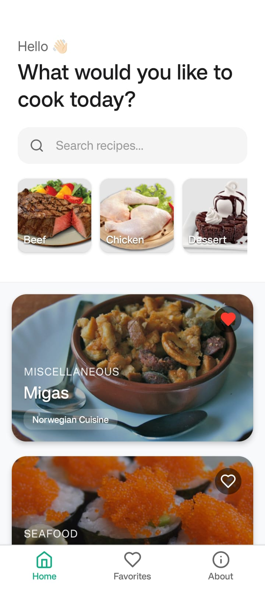
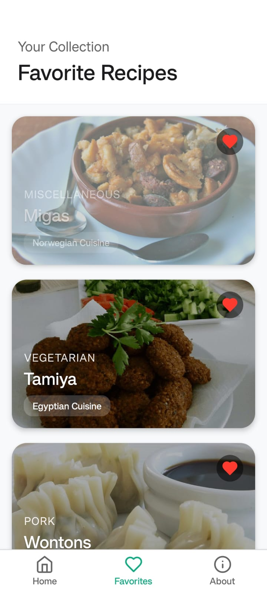
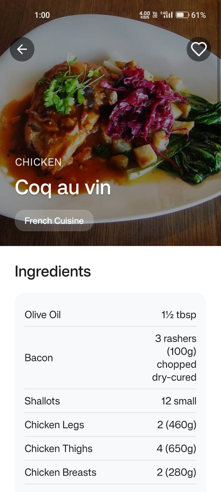
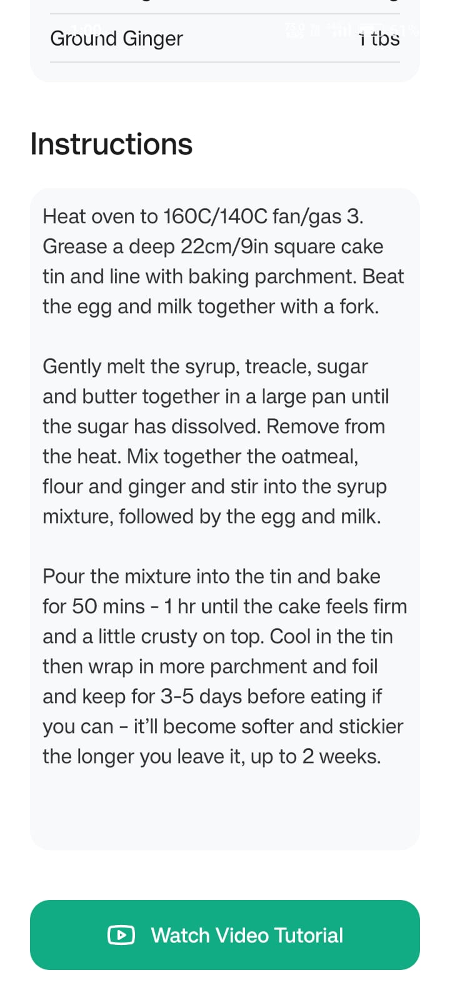
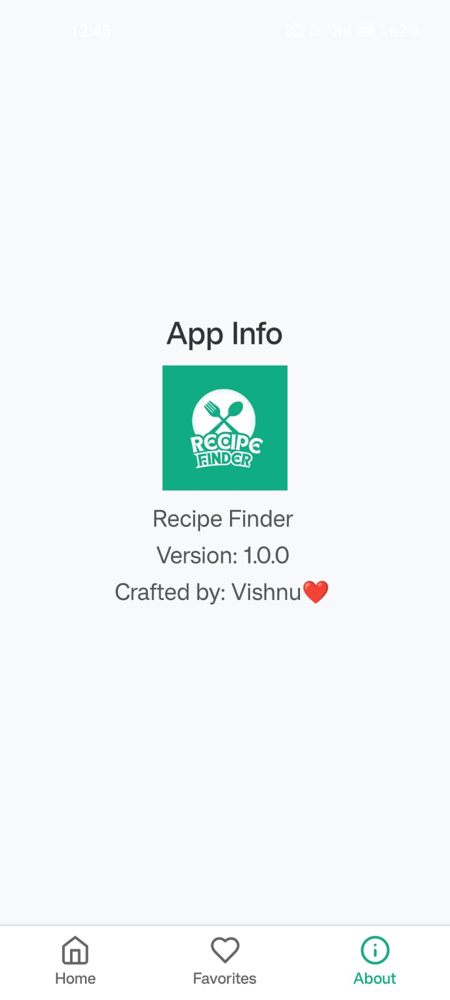

# Recipe Finder

## 🚀 Getting Started

### Prerequisites
Make sure you have the following installed:
- Node.js (Latest LTS version)
- Expo CLI
- Android Studio (for Android emulator) or an actual Android device

### Installation
1. Clone the repository:
   ```sh
   https://github.com/vishnukothakapu/Recipe_Finder-Expo_App.git
   cd Recipe_Finder-Expo_App
   ```
2. Install dependencies:
   ```sh
   npm install
   ```
3. Start the development server:
   ```sh
   npx expo start
   ```

## 📱 Running on Android Device
1. Install the **Expo Go** app from the Google Play Store.
2. Run the following command to generate the APK:
   ```sh
   eas build -p android --profile preview
   ```
3. Download the APK and install it on your phone.

## Screenshots
### Home Screen


### Favourites Screen


### Recipe Details




### About Screen



## 🛠 Technologies Used
- **React Native**
- **Expo**
- **React Navigation**
- **Typescript**
- **MealDB API**
